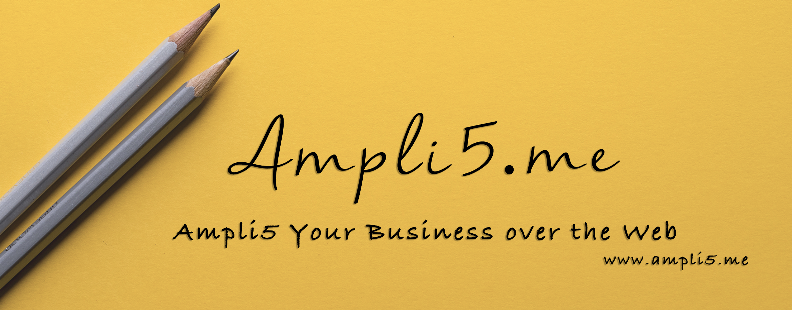

<a href="www.ampli5.me"></a>

## This is my first IOS app. It's a simple no function app. Like I am rich App.

```markdown
- This application has the below given features.

1. Loads the app
2. has only 1 lable
3. has onnly 1 image.
```

<a href="/Screenshots/screenshot1.png"></a>

#### there were few errors I came across which has been published on my blog

Blog ScrollUnlock :point_right: https://scrollunlock.wordpress.com

by Ampli5 :point_right: http://ampli5.me

### powered by 
